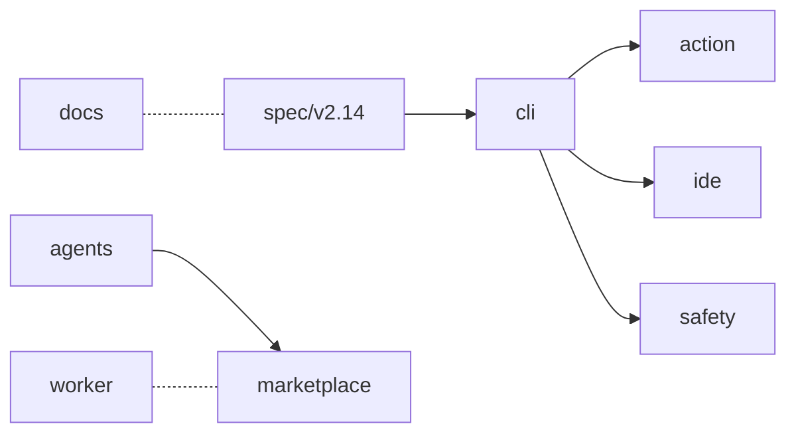

# grok-install-v2 — Architecture

**Date:** 2026-05-11
**Status:** Pre-build design. Locked-in for Phase 2a–2c. Amendments require `amend(architecture):` commit.
**Scope:** The unified ecosystem repo per DECISIONS.md D1. Will be renamed to `grok-install` at launch swap (D4).

## 1. Repo identity and audience

grok-install-v2 is the consolidated, stable surface for the AgentMindCloud ecosystem at v1.0 per D1 and D11: one repo that ships the canonical `grok-install` spec (D5 `version: "2.14"` + optional `extensions:` block), a cross-platform Python CLI (D8), a GitHub composite action, an IDE extension, a Next.js 15 marketplace (D10), the Constitution safety scanner as a plugin, a Cloudflare-Worker-backed builder/dashboard, an MkDocs docs site, ~41 production agents across simple/creator/finance/super tiers per D1, 4 LIVE HTML creator tools, and the `grok-paradoxes` Python package per D3. Its audience per D1 is *everyone* — consumers (browser flow + marketplace), developers (CLI + spec + action + IDE), and advanced creators (agents catalog + tools + paradoxes). The companion experimental repo `xlOS` (see `ARCHITECTURE-xlOS.md`) carries everything D2 split out: orchestration, debate runtimes, the Lucas-veto pattern, the live YAML playground.

## 2. Directory layout

Recommended top-level layout. CORE ships at v1.0 per D11; OPTIONAL ships if time permits; DOCS-ONLY is repository documentation that does not affect runtime. Divergences from the user's recommended layout are justified inline below the tree.

```
grok-install-v2/
  .github/
    workflows/                  CORE   CI: lint, test matrix, validate, publish (see section 6 for the 7 workflows)
    ISSUE_TEMPLATE/             CORE   Bug / feature / false-positive templates (carry-over from grok-install-action and vscode-grok-yaml)
    CODEOWNERS                  CORE   Maintainer routing
  spec/
    v2.14/                      CORE   Canonical spec per D5: spec.md + schemas/*.schema.json + 14 spec kinds folded from grok-yaml-standards
    extensions/                 CORE   Field definitions for the optional `extensions:` block per D5 (constitution, multi_agent_roles, provenance, demo_metadata, x_money_specific)
    templates/.grok/            CORE   Drop-in `.grok/*.yaml` templates for all 14 kinds, from grok-yaml-standards/.grok/
  cli/                          CORE   Python CLI (Click + platformdirs + filelock + rich + colorama) per D8; anchors PyPI `grok-install` v1.0.0 per D7
  action/                       CORE   GitHub composite action (action.yml + scripts/) from grok-install-action; TS rewrite dropped per D13
  ide/                          CORE   vscode-grok-yaml port per D5 + Q4: scanner + schema registry + diagnostics + status bar
  marketplace/                  CORE   Next.js 15 storefront folded from grok-agents-marketplace per D10; grok-agent's internal marketplace dropped per D10
  safety/                       CORE   Constitution scanner from grok-agent/safety/ exposed as a CLI plugin per D11; Constitution.md + 34 checks + RuntimeSafetyGate
  agents/
    simple/                     CORE   Deduped set of grok-install/templates/ (8) + awesome-grok-agents/templates/ (10) per Q1 resolution; CLI examples excluded
    creator/                    CORE   22 creator templates from grok-agent/templates/creator/
    finance/                    CORE   4 X-Money templates from grok-agent/templates/finance/ (companion-dashboard, cashtag-alpha, payout-optimizer, vision-analyzer)
    super/                      CORE   7 super-agents from grok-agent/templates/super-agents/, slugs per D6 (narrative-synthesizer, personal-context-agent, action-runner, agent-swarm, provenance-trust, contradiction-detector, goal-agent)
  tools/                        CORE   4 LIVE HTML tools (04 virality-scorer, 05 ab-rotator, 07 compound-calculator, 12 controversy-detector) + 3 shared libs (ui-kit, grok-client, x-api-client) from x-platform-toolkit per D13
  packages/
    grok-paradoxes/             CORE   Python package from grok-agent/packages/grok-paradoxes/ per D3; xlOS references this package per D3
  worker/                       CORE   Cloudflare Worker from grok-install/worker/ (auth + manifest + dashboard + safety check); D11 names "GitHub Pages + Cloudflare Worker for grok-install-v2"
  docs/                         CORE   MkDocs Material site from grok-docs/, minus the live YAML playground (→ xlOS per D2)
  brand/                        CORE   ONE distilled design system per D9; sourced from grok-install-brand; tokens + 5 SVGs (see section 5)
  examples/                     CORE   Reference manifests covering swarm/voice/minimal/x-reply-bot + worked tutorials; from grok-install/examples/ and grok-install-cli/examples/
  tests/                        CORE   Top-level integration harness across cli/action/ide/marketplace/safety/agents/worker
  pyproject.toml                CORE   uv project; ruff + black + mypy + pytest configured per D8
  package.json                  CORE   Top-level workspace pointer for marketplace/ and ide/ (Node 20 LTS)
  README.md                     CORE   Per skeleton in section 4
  CONTRIBUTING.md               CORE   Contribution flow folded from grok-yaml-standards and grok-install
  SECURITY.md                   CORE   Threat model + disclosure SLA from grok-yaml-standards/SECURITY.md
  DISCLAIMER.md                 CORE   Liability boundaries from grok-install/DISCLAIMER.md (carry-over: this is keep-verbatim per PORTFOLIO-MAP.md)
  PRIVACY.md                    CORE   Zero-tracking design statement from grok-install/PRIVACY.md (carry-over: keep-verbatim per PORTFOLIO-MAP.md)
  LICENSE                       CORE   Apache-2.0 (canonical text from apache.org per QW4 pattern)
  NOTICE                        CORE   Copyright 2026 AgentMindCloud
```

Divergences from the user-recommended layout:

- **Added `worker/`.** D11 names "GitHub Pages + Cloudflare Worker for grok-install-v2" but the recommended skeleton omitted it. The Worker (auth, manifest mint, dashboard, profile/mascot/safety endpoints) is ~2.5 KLOC of production logic per PORTFOLIO-MAP.md and needs its own directory with `wrangler.toml`. Open question Q3.
- **Added `DISCLAIMER.md` and `PRIVACY.md` at root.** PORTFOLIO-MAP.md marks both as keep-verbatim from grok-install; they are user-facing trust artifacts and belong at the root alongside SECURITY.md, not buried under `docs/`.
- **Added `spec/templates/.grok/`.** grok-yaml-standards ships 14 drop-in `.grok/*.yaml` templates per kind. They belong under `spec/` rather than `examples/` because they are the canonical reference, not illustrative scaffolds.
- **Added `package.json` at root.** marketplace/ (Next.js 15) and ide/ (VSCode extension) are Node toolchains; a top-level workspace pointer simplifies CI installs without forcing a full monorepo tool per section 7's non-goal.

## 3. File taxonomy

Columns: `path | purpose | source (legacy repo or NEW) | status`. Rows cover every top-level directory and the highest-value files inside each. Cross-reference DECISIONS.md D3 and D13.

| path | purpose | source | status |
|---|---|---|---|
| `spec/v2.14/spec.md` | Canonical 468-line declarative spec | grok-install/spec/v2.14/spec.md (D13) | CORE |
| `spec/v2.14/schemas/*.schema.json` | 14 Draft-2020-12 JSON Schemas (agent/config/prompts/workflow/update/test/docs/security/tools/deploy/analytics/ui/swarm/voice) | grok-yaml-standards/schemas/ + grok-install/schemas/v2.14/ (D13) | CORE |
| `spec/v2.14/SAFETY.md` | Non-negotiable safety floor | grok-install/SAFETY.md (D13) | CORE |
| `spec/extensions/*.md` | `extensions:` block field defs per D5 (constitution / multi_agent_roles / provenance / demo_metadata / x_money_specific) | NEW | CORE |
| `spec/templates/.grok/*.yaml` | 14 drop-in `.grok/` templates | grok-yaml-standards/.grok/ (D13) | CORE |
| `cli/src/grok_install/cli.py` | Click CLI entry (init/validate/scan/run/test/deploy/install/publish) | grok-install-cli/src/grok_install/cli.py (Typer→Click rewrite per D8 toolchain change) | CORE |
| `cli/src/grok_install/core/{models,parser,validator,registry}.py` | Pydantic v2 models, YAML parser, semantic validator, builtin tool registry | grok-install-cli/src/grok_install/core/ (D13) | CORE |
| `cli/src/grok_install/runtime/{client,agent,tools,memory,swarm}.py` | xAI SDK wrapper, single-agent runner, rate-limited tools, SQLite memory, swarm orchestrator | grok-install-cli/src/grok_install/runtime/ (D13) | CORE |
| `cli/src/grok_install/safety/{scanner,rules}.py` | Pre-install scanner + RuntimeSafetyGate | grok-install-cli/src/grok_install/safety/ (D13) | CORE |
| `cli/src/grok_install/deploy/{docker,vercel,railway,replit,base}.py` | 4 deploy generators behind a `DeployArtifact` protocol | grok-install-cli/src/grok_install/deploy/ + grok-build-bridge/grok_build_bridge/deploy.py (D2: pipeline + deploy → grok-install-v2) | CORE |
| `cli/src/grok_install/safety_audit/` | Two-layer regex + Grok-judge safety audit | grok-build-bridge/grok_build_bridge/safety.py + _patterns.py (D2) | CORE |
| `cli/src/grok_install/builder/` | Grok-prompt → code generator | grok-build-bridge/grok_build_bridge/builder.py (D2) | CORE |
| `cli/src/grok_install/telemetry/` | Opt-in telemetry (off by default) | grok-install-cli/src/grok_install/telemetry/ (D13) | CORE |
| `cli/tests/` | pytest matrix (parser/validator/safety/runtime/CLI smoke) | grok-install-cli/tests/ (D13) | CORE |
| `action/action.yml` | Composite GitHub Action entry | grok-install-action/action.yml (D13) | CORE |
| `action/scripts/{run.sh,annotations.js,badge.js,comment.js}` | Action runtime | grok-install-action/scripts/ (D13; D13 drops TS rewrite) | CORE |
| `action/tests/` | Zero-dep Node tests + v2.14 fixtures | grok-install-action/tests/ (D13) | CORE |
| `ide/src/extension.ts` | VSCode extension activation | vscode-grok-yaml/src/extension.ts (D13) | CORE |
| `ide/src/scanner/{cliAdapter,diagnostics}.ts` | CLI adapter + diagnostic collection | vscode-grok-yaml/src/scanner/ (D13) | CORE |
| `ide/src/schema/registry.ts` | Schema registry with content-hash URIs | vscode-grok-yaml/src/schema/registry.ts (D13; orphan schemas + unregistered commands dropped) | CORE |
| `ide/src/ui/{statusBar,commands}.ts` | Status-bar state + command wiring | vscode-grok-yaml/src/ui/ (D13) | CORE |
| `ide/intellisense-extras/` | Any unique IntelliSense/lint logic mined from grok-agent/extensions/vscode/ per Q4 resolution | grok-agent/extensions/vscode/ (Q4) | CORE |
| `marketplace/src/app/page.tsx` | Landing (RSC + hydrated stars) | grok-agents-marketplace/src/app/page.tsx (D10/D13) | CORE |
| `marketplace/src/app/marketplace/[id]/page.tsx` | Per-agent detail page | grok-agents-marketplace (D10) | CORE |
| `marketplace/src/app/api/{track-install,stats/*}/route.ts` | 5 stats endpoints + install tracker (Vercel KV) | grok-agents-marketplace (D10) | CORE |
| `marketplace/src/components/{ui,stats,marketplace}/*` | NeonButton, NebulaBackdrop, CertificationBadge, AgentPreviewCard, 12+ Recharts components | grok-agents-marketplace (D10) | CORE |
| `marketplace/src/lib/{brand,visuals/*,agents,github,telemetry-store,tracking,plausible,types}.ts` | Brand tokens (deduped against root `brand/`), Zod visuals validator, agents fetcher, GitHub stars wrapper, telemetry, types | grok-agents-marketplace (D10) | CORE |
| `marketplace/migrations/001_telemetry.sql` | KV schema | grok-agents-marketplace (D10) | CORE |
| `marketplace/vercel.json` | Next.js 15 framework + 3 regions | grok-agents-marketplace (D10) | CORE |
| `marketplace/vitest.config.ts` + `marketplace/src/lib/visuals/__tests__/` | 17 vitest cases | grok-agents-marketplace (D10) | CORE |
| `safety/constitution.md` | 7-article Constitution + per-kind enforcement matrix | grok-agent/safety/constitution.md (D13) | CORE |
| `safety/scanner.py` | 1,566-LOC, 34-check Constitution scanner exposed as `grok-install scan --plugin constitution` | grok-agent/safety/scanner.py (D13) | CORE |
| `safety/tests/` | Plugin test suite | grok-agent/safety/ + NEW glue | CORE |
| `agents/simple/<slug>/` | One subdir per deduped simple-tier agent | grok-install/templates/ + awesome-grok-agents/templates/ (Q1) | CORE |
| `agents/creator/<slug>/` | 22 creator templates (Recipe B: manifest + run.py + prompts/ + README) | grok-agent/templates/creator/ (D13) | CORE |
| `agents/finance/<slug>/` | 4 X-Money apps (companion-dashboard, cashtag-alpha, payout-optimizer, vision-analyzer) + `.streamlit/config.toml` shared | grok-agent/templates/finance/ + grok-agent/.streamlit/ (D13) | CORE |
| `agents/super/<slug>/` | 7 super-agents using D6 slugs | grok-agent/templates/super-agents/ renamed per D6 (D13) | CORE |
| `agents/featured-agents.json` | Marketplace registry feed | grok-install/featured-agents.json + awesome-grok-agents/featured-agents.json merged (D13) | CORE |
| `agents/scripts/{validate_template,validate_registry,scan_template,mock_run_template}.py` | Registry consistency + per-template structural/scan/mock validators | awesome-grok-agents/scripts/ (D13) | CORE |
| `tools/04-virality-scorer/`, `05-ab-rotator/`, `07-compound-calculator/`, `12-controversy-detector/` | 4 LIVE single-file HTML tools (localStorage bugs in 05 + 12 fixed per PORTFOLIO-MAP §x-platform-toolkit) | x-platform-toolkit/tools/ (D13) | CORE |
| `tools/shared/{ui-kit,grok-client,x-api-client,test-utils}/` | 3 shared client libs + mock-fetch helper | x-platform-toolkit/shared/ (D13) | CORE |
| `packages/grok-paradoxes/` | Standalone Python package (0.1.0 → 1.0.0), publishable separately | grok-agent/packages/grok-paradoxes/ (D3, D13) | CORE |
| `worker/src/index.js` | Cloudflare Workers entry (auth/manifest/api/dashboard/error routes) | grok-install/worker/src/index.js (D13) | CORE |
| `worker/src/handlers/{auth,api,dashboard,manifest}.js` | X + GitHub OAuth (PKCE), mint, profile/mascot/safety, analytics, pause/resume/delete | grok-install/worker/src/handlers/ (D13) | CORE |
| `worker/src/lib/{response,logger,yaml-validator,pkce,genesis,kv,mascots,x-api,github,xai,repo-template,prompts}.js` | ~2.5 KLOC worker logic | grok-install/worker/src/lib/ (D13) | CORE |
| `worker/wrangler.toml` | Worker deploy config | grok-install/wrangler.toml (D13) | CORE |
| `docs/mkdocs.yml` + `docs/docs/` | MkDocs Material site (getting-started, cli/reference, guides, v2.14, ecosystem) | grok-docs/ (D13; playground component → xlOS per D2) | CORE |
| `docs/docs/v2.14/{visuals,accessibility}.md` | WCAG 2.2 AA reference | grok-docs/docs/v2.14/ (D13) | CORE |
| `docs/javascripts/extra.js` | Terminal animation (respects prefers-reduced-motion) | grok-docs/docs/javascripts/extra.js (D13) | CORE |
| `brand/tokens.json` | Single-source design tokens (colors, spacing, typography) | NEW (distilled per D9 from grok-install-brand/, grok-install-action/grok-install-brand/tokens/colors.css, grok-agents-marketplace/src/lib/brand.ts) | CORE |
| `brand/banner.svg` | Repo hero banner (one only, <200KB per D9) | NEW (one chosen from grok-install-brand/banners/ per D9) | CORE |
| `brand/logo-mark.svg`, `logo-wordmark.svg`, `social-card.svg` | Identity assets | grok-install/assets/{logo-dark,logo-light}.svg + grok-install/assets/og-image.svg (D13) | CORE |
| `brand/icons/*.svg` | 8 core glyphs | grok-install-brand/icons/ (D13) | OPTIONAL |
| `brand/generators/banner-svg.js` | Parameterized banner generator | grok-install-brand/generators/banner-svg.js (D13; extracted to npm package per PORTFOLIO-MAP gem note) | OPTIONAL |
| `examples/{minimal,x-reply-bot,research-swarm,voice-agent}.yaml` | 4 reference manifests | grok-install/examples/ + grok-install-cli/examples/ (D13) | CORE |
| `tests/` | Cross-component integration harness | NEW | CORE |
| `.github/workflows/*.yml` | 7 workflows (see section 6) | grok-install + grok-install-cli + grok-install-action + grok-yaml-standards + awesome-grok-agents merged (D13) | CORE |
| `pyproject.toml` | uv project, ruff + black + mypy + pytest per D8 | NEW (toolchain per D8) | CORE |
| `package.json` | Workspace root for marketplace/ + ide/ | NEW | CORE |
| `README.md` | Per skeleton in section 4 | NEW | CORE |
| `CONTRIBUTING.md` | Contribution flow | grok-yaml-standards + grok-install + awesome-grok-agents (D13) | CORE |
| `SECURITY.md` | Threat model + disclosure SLA | grok-yaml-standards/SECURITY.md (D13) | CORE |
| `DISCLAIMER.md` | Liability boundaries | grok-install/DISCLAIMER.md (D13) | CORE |
| `PRIVACY.md` | Zero-tracking statement | grok-install/PRIVACY.md (D13) | CORE |
| `LICENSE`, `NOTICE` | Apache-2.0 + AgentMindCloud copyright | grok-install-brand/QW4 pattern | CORE |

## 4. README template

The README is the only public-facing landing surface that ships in the repo (the marketplace and docs site are separate surfaces). It MUST conform to D9: ONE banner, no capsule-render, no typing-svg, no emoji-tables, no "Phase N" / "Tier N" / "Spectral" language. Skeleton:

````markdown
<!-- hero: ./brand/banner.svg only, <200KB per D9 -->


# grok-install

<one-paragraph pitch: what grok-install is, who uses it, what shipping at v1.0 gets them — referenced from D1 audience and D11 launch scope; no jargon, no phase-talk per D9>

## Install

```bash
# macOS / Linux
curl -sSf https://grok-install.dev/install.sh | sh

# Cross-platform (Python ≥ 3.11 per D8)
pip install grok-install

# Windows
winget install AgentMindCloud.GrokInstall
```

## Quick start

1. `grok-install init my-agent`
2. `grok-install validate my-agent/grok-install.yaml`
3. `grok-install run my-agent`

## Features

<prose paragraph; no emoji-status tables per D9. Mention: declarative agent spec v2.14, cross-platform CLI per D8, GitHub Action, IDE extension, marketplace, Constitution scanner, 4 LIVE creator tools, agents catalog.>

## Architecture



(One high-level diagram only. Do not embed status emojis, percentages, or stats from PORTFOLIO-MAP — those belong on the live marketplace, not in README.)

## Agents

<short prose pointer to the marketplace URL and a one-line description of each tier (simple / creator / finance / super per D1). Link to ./agents/ for the in-repo tree.>

## Spec

The full grok-install spec is in [`spec/v2.14/`](./spec/v2.14/). Optional `extensions:` block fields are defined in [`spec/extensions/`](./spec/extensions/) per D5.

## Tools and packages

- [`tools/`](./tools/) — 4 single-file HTML creator tools + shared libs.
- [`packages/grok-paradoxes`](./packages/grok-paradoxes/) — standalone Python package.

## Safety

- [`SAFETY.md`](./spec/v2.14/SAFETY.md) — non-negotiable safety floor.
- [`safety/`](./safety/) — Constitution scanner plugin.
- [`SECURITY.md`](./SECURITY.md), [`DISCLAIMER.md`](./DISCLAIMER.md), [`PRIVACY.md`](./PRIVACY.md).

## Contributing

See [`CONTRIBUTING.md`](./CONTRIBUTING.md).

## License

Apache-2.0. See [`LICENSE`](./LICENSE) and [`NOTICE`](./NOTICE).
````

## 5. Brand standards

Per D9: distill the best of grok-install-brand into ONE design system, shared between this repo and xlOS. capsule-render, typing-svg, emoji-status rows, and "Phase N" / "Tier N" / "Spectral" terminology are BANNED in user-facing files.

| Attribute | Value | Source / rationale |
|---|---|---|
| Banner dimensions | 1500 × 500 px, SVG, < 200KB | grok-install-brand/banners/ shipping format; D9 size cap |
| Logo mark | Square SVG, 64×64 viewport | grok-install/assets/favicon.svg + logo-dark/light.svg |
| Logo wordmark | Horizontal SVG, height-normalized to 48px | grok-install/assets/logo-dark.svg |
| Social card | 1200 × 630 px, SVG | grok-install/assets/og-image.svg |
| Typography (sans) | Inter, system-ui fallback | grok-docs/docs/stylesheets/extra.css |
| Typography (mono) | JetBrains Mono, monospace fallback | grok-docs/docs/stylesheets/extra.css |
| Palette (3 hex max per template) | `#0A0A0A` (background/text), `#00F0FF` (primary accent), `#00FF9D` (secondary accent) | grok-install-action/grok-install-brand/tokens/colors.css — canonical embedded form; grok-agents-marketplace's "Plasma/Aurora" palette is dropped per D9's distillation directive (open question Q5) |
| Logo placement | Top-left of any rendered surface; min margin 16px; never on busy photographic backgrounds; pairs only with neutral or palette-matched fills | NEW; codifies grok-install-brand practice |

`brand/` directory contents (locked):

```
brand/
  tokens.json          colors + spacing + typography + radii + shadows; single source consumed by CLI rich theme, marketplace tailwind, ide CSS, worker dashboards
  banner.svg           one canonical hero banner
  logo-mark.svg        square monogram
  logo-wordmark.svg    horizontal wordmark
  social-card.svg      OG / Twitter card
  icons/               8 glyphs (OPTIONAL per section 2)
  generators/banner-svg.js  parameterized banner generator (OPTIONAL)
```

## 6. CI matrix

Seven workflows under `.github/workflows/`. CI must be green on commit #1 of Phase 2a.

| Workflow | Trigger | Matrix / job |
|---|---|---|
| `lint.yml` | push, pull_request | single job: `uv run ruff check`, `uv run black --check`, `uv run mypy` per D8 toolchain |
| `test.yml` | push, pull_request | matrix: `os ∈ {ubuntu-latest, macos-latest, windows-latest}` × `python ∈ {3.11, 3.12}` per D8; runs `uv run pytest cli/tests tests/` |
| `marketplace.yml` | pull_request paths: `marketplace/**` | single job on `ubuntu-latest`: Node 20 LTS, `pnpm install`, `pnpm build`, `pnpm vitest run`, lighthouse-ci against built site |
| `validate-templates.yml` | push, pull_request paths: `agents/**`, `spec/**` | single job: `uv run grok-install validate` on every `agents/**/grok-install.yaml`; runs registry consistency + scan + mock per `agents/scripts/` |
| `publish-pypi.yml` | release published (tag `v*`) | single job: `uv build`, Trusted Publishing to PyPI as `grok-install` per D7; signs and uploads sdist + wheel |
| `publish-action.yml` | release published (tag `action-v*`) | single job: validates `action.yml`, posts release to GitHub Marketplace |
| `publish-vscode.yml` | release published (tag `ide-v*`) | single job: VSCode Marketplace + Open VSX publish; tag-version-guarded |

Notes:
- The `validate-schemas.yml` from grok-yaml-standards is folded into `validate-templates.yml` (yamllint + ajv on every `.grok/*.yaml` and `spec/v2.14/schemas/**`).
- A `safety-scan.yml` is intentionally NOT a separate workflow; the Constitution scanner runs as a step inside `validate-templates.yml` per D11's "plugin" framing.
- The `release.yml` patterns from grok-install-cli + grok-yaml-standards + awesome-grok-agents are merged into the three `publish-*.yml` workflows by deploy target.

## 7. Out of scope (explicit non-goals)

Deferred per D11 verbatim:
- Mobile native apps
- pulse/ MCP server beyond pulse_today
- eval-delta workflows
- Real-time analytics dashboards
- v2.15 RFC
- Multiple language ports
- bridge_live/ FastAPI inspector (deferred per Q5 resolution; needs 8h security fix list before shipping)

Additional architectural non-goals:
- No monorepo tooling (nx / turbo / rush). Top-level `package.json` is a workspace pointer only; Python and Node sub-trees use their own native tooling.
- No plugin runtime beyond Python entry points. The Constitution scanner is a `grok-install scan --plugin constitution` entry point, not a hot-loaded plugin host.
- No telemetry beyond the marketplace's existing Vercel KV stats endpoints. CLI telemetry stays opt-in and off-by-default per grok-install-cli/`telemetry/` carry-over.
- No subtree migration of grok-agent's `tools/` (the x-platform-toolkit re-fold) or `pulse/` (incomplete MCP scaffold) per PORTFOLIO-MAP.md and D13.
- No PowerShell CLI in the repo per D8 ("PowerShell CLI from grok-agent ... not committed to the new repo").
- No browser extension (grok-agent/extensions/browser/ is archive-as-reference per PORTFOLIO-MAP.md).
- No v2.0 orphan agents from awesome-grok-agents (`viral-thread-architect`, `voice-companion` are dropped per PORTFOLIO-MAP.md).
- No spec-only x-platform-toolkit tools (only the 4 LIVE tools migrate per D13).

## 8. Open questions for human review

1. **`combined.py` (run_combined_bridge_orchestra) target repo.** PORTFOLIO-MAP.md targets it for grok-install-v2 ("Bridge + Orchestra integration ... keep verbatim — target: grok-install-v2"), but D2 puts Orchestra primitives in xlOS. If `combined.py` lives in grok-install-v2 it requires xlOS as a runtime dependency, inverting the stable/experimental split established in D1. Recommend moving it to `xlOS/orchestration/combined.py` so the standalone Bridge pipeline in `cli/src/grok_install/safety_audit/` + `cli/src/grok_install/builder/` + `cli/src/grok_install/deploy/` stays self-contained; the combined Bridge+Orchestra runner lives where Orchestra does. Confirm.
2. **Orchestra "infrastructure" files (cli.py, _roles.py, _errors.py, _templates.py, sources/, tracing/, Dockerfile) from grok-agent-orchestra.** PORTFOLIO-MAP.md tags each at `grok-install-v2`, but D2's lock-in is that the orchestration framework lives in xlOS. Treating those files as targets of `grok-install-v2` produces a partial Orchestra in this repo that cannot run on its own. Recommend: the whole `grok_orchestra/` Python package (including sources/, tracing/, _roles.py, _errors.py, _templates.py, cli.py) goes to xlOS as a single unit; only `safety_audit/` (Lucas-veto) is the cross-cutting piece that gets the dedicated `xlOS/safety/lucas-veto/` placement per D2. Confirm.
3. **Cloudflare Worker placement.** Added `worker/` at the root because D11 mentions it explicitly but the user's recommended layout omitted it. Options: (a) keep at `worker/` as a peer to `cli/` and `marketplace/`, (b) nest under `marketplace/worker/` to colocate with the storefront it backs, (c) nest under `docs/worker/`. Recommend (a) for clean separation. Confirm.
4. **Streamlit-based finance dashboards (`agents/finance/`).** The 4 X-Money apps in grok-agent/templates/finance/ ship as Streamlit apps with SQLite + yfinance + Newsapi backends and their own launchers. They live under `agents/finance/` but their runtime contract differs from a normal `grok-install.yaml` agent (Streamlit process vs xAI-SDK loop). Phase 2b needs to decide whether they are full agents under the same CLI lifecycle (`grok-install run` learns a Streamlit launcher) or sub-apps with a parallel `streamlit run` story documented in their READMEs. Recommendation: sub-apps with parallel story; flag in marketplace as a distinct certification badge (`finance-app`).
5. **Brand palette choice.** D9 says "distill best of grok-install-brand into ONE design system." Two palette lineages exist: the canonical `#0A0A0A` + `#00F0FF` + `#00FF9D` + `#FF2D55` quartet (used by grok-install, grok-install-action, grok-install-brand, grok-docs, grok-yaml-standards) and the marketplace's "Plasma `#FF1E70`" + "Aurora `#00E0D5`" pair (newer, recently landed in grok-agents-marketplace). Section 5 picks the canonical trio because the surface area using it is wider and "Spectral" terminology is banned per D9. Confirm or switch to Plasma+Aurora before Phase 2a.
6. **`grok-build-bridge/vscode/schemas/bridge.schema.json`.** PORTFOLIO-MAP.md tags it as keep-verbatim with a 1h "sync Draft 2020-12 + 6-target enum with main schema" fix. Targets the IDE extension. Section 3 implicitly absorbs it via `ide/` but it could equally live in `spec/v2.14/schemas/`. Recommend `spec/v2.14/schemas/bridge.schema.json` so the IDE reads from one canonical source. Confirm.
