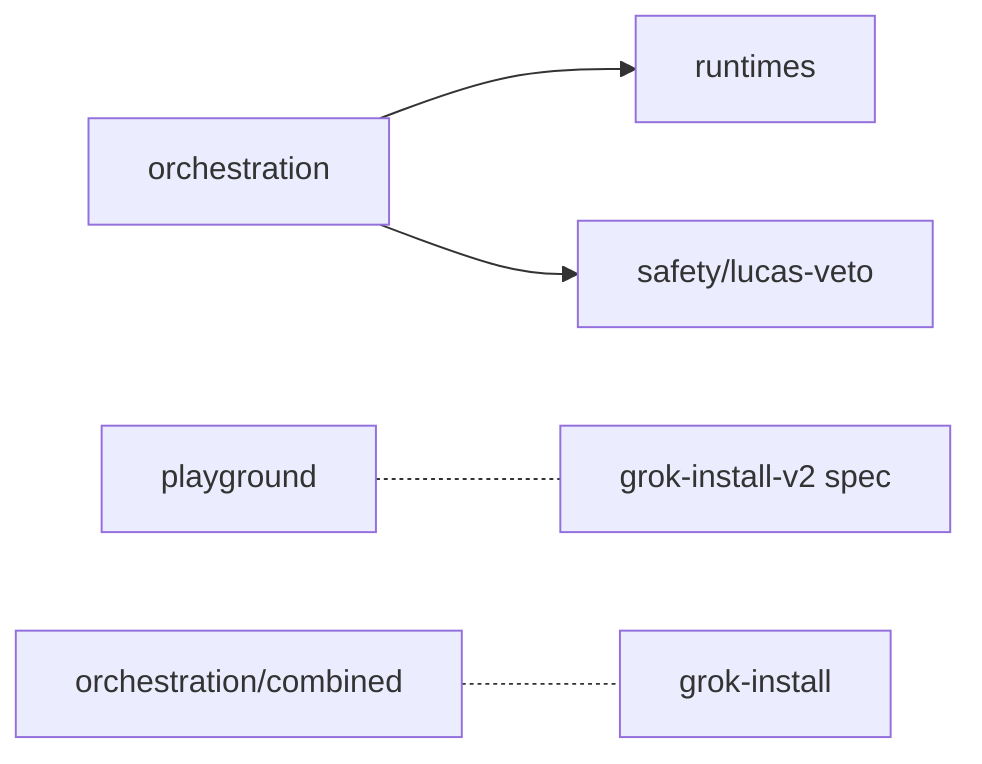

# xlOS — Architecture

**Date:** 2026-05-11
**Status:** Pre-build design. Locked-in for Phase 3a–3d. Amendments require `amend(architecture):` commit.
**Scope:** Experimental sibling per DECISIONS.md D1. Lab for orchestration, debate runtimes, Lucas-veto safety, live YAML playground.
**Fallback:** If gem extraction in Phase 3a–3b proves too entangled, xlOS v1.0 ships as README + LICENSE only and orchestration migration slips to v1.1 (D2 fallback).

## 1. Repo identity and audience

xlOS is the explicitly experimental sibling to `grok-install-v2` per D1: researcher-facing, future-power-user-facing, NOT a stable consumer surface. It carries everything D2 split out — the 5 orchestration patterns and roles + xAI-native + simulated debate runtimes from `grok-agent-orchestra`, the Lucas-veto safety pattern from `grok-build-bridge`, the live client-side YAML playground from `grok-docs`, and a `research/` placeholder for the voice/swarm research surfaces named in D1. xlOS publishes as PyPI `xlos` (lowercase, normalized per D7) and reuses `grok-install-v2`'s brand system per D9 with a single distinguishing accent color to signal experimental status. Per D2's fallback clause, if Phase 3a's extraction from grok-agent-orchestra is too entangled, xlOS v1.0 ships as README + LICENSE only; the README must say so plainly.

## 2. Directory layout

Recommended top-level layout. CORE ships at v1.0 if extraction succeeds; under the D2 fallback, only the README + LICENSE + NOTICE ship at v1.0 and the rest moves to v1.1. Divergences from the user's recommended layout are justified inline.

```
xlOS/
  .github/
    workflows/                  CORE   4 workflows (see section 6)
    ISSUE_TEMPLATE/             CORE   Bug / feature templates
    CODEOWNERS                  CORE
  orchestration/                CORE   5 patterns + roles, from grok-agent-orchestra per D2
    patterns/                   CORE   hierarchical / dynamic-spawn / debate-loop / parallel-tools / recovery (≤120 LOC each)
    roles/                      CORE   GROK / HARPER / BENJAMIN / LUCAS system prompts + default tool routing
    cli/                        CORE   Top-level CLI (`xlos run`, `xlos debate`, `xlos veto`, `xlos validate`, `xlos templates`, `xlos init`)
    streaming/                  CORE   Rich TUI debate rendering
    templates/                  CORE   Bundled starter YAMLs + JSON schema for IDE completions
    tracing/                    CORE   LangSmith + OTel/OTLP backends, NoOpTracer default
    sources/                    OPTIONAL Web research (Tavily), MCP sources, robots.txt cache, budget tracking
    combined.py                 CORE   Bridge + Orchestra integration (relocated from grok-install-v2 per Q2 — depends on grok-install package being installed)
  runtimes/                     CORE   xAI native + simulated debate runtimes, from grok-agent-orchestra per D2
    native.py                   CORE   Direct grok-4.20-multi-agent-0309 dispatcher (4 or 16 agents)
    simulated.py                CORE   Prompt-simulated debate engine (llama3.1:8b local or grok-4.20)
    multi_agent_client.py       CORE   xAI multi-agent streaming wrapper + typed MultiAgentEvent
  safety/
    lucas-veto/                 CORE   Lucas fail-closed veto from grok-build-bridge per D2 (grok-4.20-0309 @ reasoning_effort=high, strict JSON)
  playground/                   CORE   Live client-side YAML playground from grok-docs per D2 (Monaco + js-yaml + Ajv, JSON-pointer error reporting, zero network)
  research/                     OPTIONAL Voice/swarm research surfaces; placeholder for v1.x per D1 ("voice/swarm research surfaces")
  benchmarks/                   OPTIONAL 12-goal corpus vs GPT-Researcher, hallucination scoring (from grok-agent-orchestra/benchmarks/)
  frontend/                     OPTIONAL Next.js real-time debate visualization (40h port per PORTFOLIO-MAP estimate)
  extensions/
    vscode/                     OPTIONAL VSCode extension for orchestration YAML (12h port per PORTFOLIO-MAP)
  skills/                       OPTIONAL Claude Skill for `agent-orchestra` from grok-agent-orchestra/skills/
  examples/                     CORE   15 executable YAML examples (all 5 patterns, local Ollama, cloud BYOK, MCP sources, image generation)
  docs/                         CORE   MkDocs site (orchestration / debate / Lucas / playground tutorials)
  tests/                        CORE   pytest matrix harness — same toolchain as grok-install-v2 per D8
  pyproject.toml                CORE   uv project, ruff + black + mypy + pytest configured per D8; publishes as `xlos` per D7
  README.md                     CORE   Per skeleton in section 4 — opens with experimental badge + D2 fallback note
  CONTRIBUTING.md               CORE   Same flow as grok-install-v2
  SECURITY.md                   CORE
  LICENSE                       CORE   Apache-2.0
  NOTICE                        CORE   Copyright 2026 AgentMindCloud
```

Divergences from the user's recommended layout:

- **Split `orchestration/` into sub-directories.** PORTFOLIO-MAP.md inventories 13 distinct gems inside grok-agent-orchestra's `grok_orchestra/` package (patterns.py, _roles.py, cli.py, streaming.py, _templates.py + templates/, tracing/, sources/, combined.py, plus the safety + runtime files which get their own top-level dirs). Flattening them under `orchestration/` would lose structure; the sub-tree mirrors the source tree.
- **Pulled `multi_agent_client.py` into `runtimes/`.** PORTFOLIO-MAP.md tags it "archive-as-reference" but it is the streaming-wrapper backbone the two runtimes share. Promoting it to CORE under `runtimes/` per the D2 lock-in of "xAI native + simulated debate runtimes" — without it, neither runtime works.
- **Relocated `combined.py` from grok-install-v2.** Per open question Q2 below. The Bridge pipeline lives in `grok-install-v2/cli/src/grok_install/{safety_audit,builder,deploy}/`; `combined.py` is the integration that wires Bridge + Orchestra, and it can only run when both are installed. It belongs with the experimental Orchestra surface.
- **Added `benchmarks/`, `frontend/`, `extensions/vscode/`, `skills/` as OPTIONAL.** PORTFOLIO-MAP.md tags each of these for xlOS but flags large port costs (frontend 40h, vscode 12h, skill keep-verbatim, benchmarks "archive-as-reference"). Marking them OPTIONAL preserves them in the layout without committing to v1.0 ship.

## 3. File taxonomy

| path | purpose | source | status |
|---|---|---|---|
| `orchestration/patterns/{hierarchical,dynamic_spawn,debate_loop,parallel_tools,recovery}.py` | 5 composable orchestration patterns, ≤120 LOC each | grok-agent-orchestra/grok_orchestra/patterns.py (D2, D3) | CORE |
| `orchestration/roles/` | GROK coordinator, HARPER researcher (+ web_search), BENJAMIN logician (+ opt-in code_execution), LUCAS contrarian; prompts + default tool routing | grok-agent-orchestra/grok_orchestra/_roles.py (PORTFOLIO-MAP target was grok-install-v2; moved per Q2) | CORE |
| `orchestration/cli/__init__.py` | Top-level Typer CLI (`xlos run`, `combined`, `validate`, `templates`, `init`, `debate`, `veto`) | grok-agent-orchestra/grok_orchestra/cli.py (Q2) | CORE |
| `orchestration/streaming/` | Rich TUI debate rendering (role-colored lanes, reasoning ticks, tool calls, verdict panel) | grok-agent-orchestra/grok_orchestra/streaming.py (D2) | CORE |
| `orchestration/templates/` | 10 bundled starter YAMLs + JSON schema for IDE completions | grok-agent-orchestra/grok_orchestra/_templates.py + templates/ (Q2) | CORE |
| `orchestration/tracing/` | LangSmith + OTel/OTLP backends; NoOpTracer default | grok-agent-orchestra/grok_orchestra/tracing/ (Q2) | CORE |
| `orchestration/sources/` | Web research (Tavily), MCP sources, robots.txt cache, budget tracking, fetch w/ timeout-retry | grok-agent-orchestra/grok_orchestra/sources/ (Q2) | OPTIONAL |
| `orchestration/combined.py` | `run_combined_bridge_orchestra()` master pipeline (build → scan → debate → veto → deploy) | grok-agent-orchestra/grok_orchestra/combined.py (relocated from grok-install-v2 per Q2) | CORE |
| `orchestration/errors.py` | Error contract (EXIT_RUNTIME=1, EXIT_CONFIG=2, EXIT_SAFETY_VETO=4); render_error_panel() | grok-agent-orchestra/grok_orchestra/_errors.py (Q2) | CORE |
| `runtimes/native.py` | Direct `grok-4.20-multi-agent-0309` dispatcher (4 or 16 agents, server-side role routing, single aggregated stream); OrchestraResult dataclass | grok-agent-orchestra/grok_orchestra/runtime_native.py (D2 explicit) | CORE |
| `runtimes/simulated.py` | Prompt-simulated debate engine (GROK/HARPER/BENJAMIN/LUCAS roles, round-by-round, llama3.1:8b local or grok-4.20) | grok-agent-orchestra/grok_orchestra/runtime_simulated.py (D2 explicit) | CORE |
| `runtimes/multi_agent_client.py` | xAI multi-agent streaming wrapper; MultiAgentEvent dataclass; RateLimitError fallback | grok-agent-orchestra/grok_orchestra/multi_agent_client.py (promoted to CORE per layout divergence note) | CORE |
| `safety/lucas-veto/veto.py` | Lucas fail-closed veto (grok-4.20-0309 @ reasoning_effort=high, strict JSON, retry loop, malformed → safe=False) | grok-build-bridge code per D2 + grok-agent-orchestra/grok_orchestra/safety_veto.py merged | CORE |
| `safety/lucas-veto/README.md` | Pattern docs + integration contract for grok-install-v2 callers | NEW | CORE |
| `playground/index.html` + `playground.js` | Live in-browser YAML validator (Monaco + js-yaml + Ajv), JSON-pointer error reporting, live preview of v2.14 visuals; zero network | grok-docs/docs/playground/index.md + grok-docs/docs/javascripts/playground.js (D2 explicit) | CORE |
| `research/README.md` | Voice/swarm research-surface placeholder | NEW (D1 names "voice/swarm research surfaces") | OPTIONAL |
| `benchmarks/` | 12-goal corpus vs GPT-Researcher, Claude Sonnet judge, factual + hallucination scoring | grok-agent-orchestra/benchmarks/ (PORTFOLIO-MAP archive-as-reference; OPTIONAL here) | OPTIONAL |
| `benchmarks/methodology.md` | Peer-review rubric (tokens, cost, wall time, citations, hallucination window, Lucas veto correctness) | grok-agent-orchestra/benchmarks/methodology.md | OPTIONAL |
| `frontend/` | Next.js real-time debate visualization (live agent status, reasoning gauge, citation export) | grok-agent-orchestra/frontend/ (40h port estimate) | OPTIONAL |
| `extensions/vscode/` | VSCode extension (YAML validation, right-click run, side-panel webview, Lucas verdict bench) | grok-agent-orchestra/extensions/vscode/ (12h port estimate) | OPTIONAL |
| `skills/agent-orchestra/` | Claude Skill (local CLI or remote FastAPI POST transport) | grok-agent-orchestra/skills/ | OPTIONAL |
| `examples/*.yaml` | 15 executable YAML examples covering all 5 patterns + local Ollama + cloud BYOK + MCP + image generation | grok-agent-orchestra/examples/ | CORE |
| `docs/mkdocs.yml` + `docs/docs/` | Mode deep-dive; capability matrix (Demo/Local/Cloud); VSCode integration | grok-agent-orchestra/docs/ + grok-agent-orchestra/mkdocs.yml | CORE |
| `tests/` | pytest harness covering patterns, runtimes, Lucas veto, examples-boot | NEW + grok-agent-orchestra test snippets | CORE |
| `pyproject.toml` | uv project, ruff + black + mypy + pytest per D8; publishes as `xlos` per D7 | NEW (toolchain per D8) | CORE |
| `README.md` | Per skeleton in section 4 (experimental badge first + fallback note) | NEW | CORE |
| `CONTRIBUTING.md` | Same flow as grok-install-v2 | NEW (mirror of grok-install-v2/CONTRIBUTING.md) | CORE |
| `SECURITY.md` | Same threat-model template as grok-install-v2 | NEW (mirror) | CORE |
| `LICENSE`, `NOTICE` | Apache-2.0 + AgentMindCloud copyright | grok-install-brand/QW4 pattern | CORE |

## 4. README template

Same skeleton format as `ARCHITECTURE-grok-install-v2.md` section 4, but the README MUST open with an "Experimental" badge/note clarifying this is a research surface, not a stable product, and reference the v1.0 fallback explicitly. D9 brand rules (one banner, no capsule-render, no typing-svg, no emoji-tables, no Phase/Tier/Spectral) apply unchanged.

````markdown
<!-- hero: ./brand/banner.svg (xlOS variant with the experimental accent color from section 5), <200KB per D9 -->


# xlOS

> **Experimental.** xlOS is the AgentMindCloud research surface — not a stable consumer product. For the stable ecosystem use [`grok-install`](https://github.com/AgentMindCloud/grok-install).
>
> If you are reading this and the directory tree is empty, xlOS v1.0 shipped as a placeholder per [DECISIONS.md D2](https://github.com/AgentMindCloud/ecosystem-redesign/blob/main/DECISIONS.md#d2--resolution-of-contradiction-1-xlos-scope-sources) and full functionality lands in v1.1.

<one-paragraph pitch: experimental sibling for orchestration patterns, debate runtimes, the Lucas-veto safety pattern, the live YAML playground; targeted at researchers and advanced builders per D1.>

## Install

```bash
# Python ≥ 3.11 per D8
pip install xlos

# Optional: install grok-install alongside for combined Bridge + Orchestra runs
pip install grok-install
```

## Quick start

1. `xlos init my-debate`
2. `xlos validate my-debate/orchestration.yaml`
3. `xlos debate my-debate` — runs a 4-role debate; pair with `xlos veto` for the Lucas fail-closed gate.

## Features

<prose paragraph; no emoji-status tables per D9. Mention: 5 orchestration patterns, xAI-native and simulated debate runtimes, Lucas-veto safety, in-browser YAML playground, research surfaces for voice and swarm.>

## Architecture



(Diagram only; no fabricated metrics or stats.)

## Patterns and runtimes

- [`orchestration/patterns/`](./orchestration/patterns/) — 5 patterns
- [`runtimes/`](./runtimes/) — xAI-native + simulated debate runtimes
- [`safety/lucas-veto/`](./safety/lucas-veto/) — fail-closed safety gate
- [`playground/`](./playground/) — live YAML validator
- [`examples/`](./examples/) — 15 executable orchestrations

## Relationship to grok-install

xlOS depends on `grok-install` only for the `combined` run (Bridge + Orchestra). Everything else in xlOS runs standalone. See [DECISIONS.md D1–D3](https://github.com/AgentMindCloud/ecosystem-redesign/blob/main/DECISIONS.md#d1--two-repo-architecture) for the split.

## Contributing

See [`CONTRIBUTING.md`](./CONTRIBUTING.md). xlOS is a research lab; API surfaces may break between minor versions.

## License

Apache-2.0. See [`LICENSE`](./LICENSE) and [`NOTICE`](./NOTICE).
````

## 5. Brand standards

Shared with `grok-install-v2` per D9. The `brand/` directory in this repo is a thin pointer — either a git submodule into `grok-install-v2/brand/`, or a copy with `tokens.json` regenerated from the canonical source. Files: `brand/tokens.json`, `brand/banner.svg`, `brand/logo-mark.svg`, `brand/logo-wordmark.svg`, `brand/social-card.svg` — same names as grok-install-v2, same dimensions, same typography (Inter + JetBrains Mono).

ONE distinguishing element per the user's directive: **experimental accent color = `#FF2D55`** (the fourth value in the canonical grok-install-brand palette per grok-install-action/grok-install-brand/tokens/colors.css). Applied to:
- The "Experimental" badge in the README and docs site header
- Section dividers in the docs site
- The banner's accent stripe (rest of the banner uses the shared `#00F0FF` / `#00FF9D` accents)
- The Rich TUI "veto verdict" panel border in `orchestration/streaming/`

xlOS MUST NOT introduce a second palette. The single accent above is the only divergence; D9's "ONE design system" remains the rule.

## 6. CI matrix

Four workflows under `.github/workflows/`. CI must be green on commit #1 of Phase 3a (or commit #1 of Phase 3a-fallback if the D2 fallback fires).

| Workflow | Trigger | Matrix / job |
|---|---|---|
| `lint.yml` | push, pull_request | single job: `uv run ruff check`, `uv run black --check`, `uv run mypy` per D8 toolchain |
| `test.yml` | push, pull_request | matrix: `os ∈ {ubuntu-latest, macos-latest, windows-latest}` × `python ∈ {3.11, 3.12}` per D8; runs `uv run pytest tests/` |
| `validate-orchestrations.yml` | push, pull_request paths: `examples/**`, `orchestration/templates/**` | single job: validates every example orchestration parses + boots in dry-run; covers all 5 patterns |
| `publish-pypi.yml` | release published (tag `v*`) | single job: `uv build`, Trusted Publishing to PyPI as `xlos` per D7 |

Under the D2 fallback (placeholder repo), only `lint.yml` and `publish-pypi.yml` run; `test.yml` and `validate-orchestrations.yml` ship empty in v1.0 and are enabled in v1.1.

## 7. Out of scope

- Stable consumer surface (that is grok-install-v2's job per D1).
- The unified spec / CLI / action / marketplace / safety scanner / agents catalog (all live in grok-install-v2 per D1, D10, D11).
- Anything in DECISIONS.md D11 deferred list (mobile native apps, pulse/ beyond pulse_today, eval-delta workflows, real-time analytics dashboards, v2.15 RFC, multiple language ports, bridge_live/ FastAPI inspector).
- The frontend / vscode / skills surfaces ship as OPTIONAL only; if Phase 3a runs hot, they slip to v1.1 without changing v1.0's CORE definition.
- A second brand palette. xlOS reuses grok-install-v2's tokens with a single accent override per section 5.

## 8. Open questions for human review

Extraction-feasibility risk is the dominant unknown for xlOS. Items 1–3 below are extraction-related; flag any that you read as red and the D2 fallback (xlOS v1.0 = README + LICENSE only) becomes the realistic plan rather than the safety net.

1. **Extraction feasibility from `grok-agent-orchestra` is materially uncertain.** PORTFOLIO-MAP.md inventories the gems with these port estimates: patterns 12h, safety_veto 8h, simulated runtime 10h, streaming TUI 8h, sources 20h integration testing, frontend 40h port, vscode extension 12h, plus a handful of "keep verbatim" gems that still need re-wiring to a new package name. Cumulative core-only port budget is ~58 hours of focused work before any examples run; with research/voice/swarm placeholders deferred, ~38h. If Phase 3a is bounded to one focused sprint (≤40h), then `frontend/`, `extensions/vscode/`, and `sources/` may need to ship as v1.1, and the README must explicitly state which CORE/OPTIONAL items did and did not land. Recommend setting a hard time-box upfront — "30 working hours, then ship what's done; if patterns + safety + runtimes + playground are not all green, fall back to D2 placeholder" — so the fallback decision is mechanical rather than tasteful. Confirm the time-box and the fallback trigger conditions.
2. **`combined.py` relocation (mirrors grok-install-v2 Q1).** PORTFOLIO-MAP.md targets it for grok-install-v2; this architecture relocates it to `orchestration/combined.py` so the standalone grok-install Bridge pipeline (safety_audit + builder + deploy) doesn't pull xlOS as a runtime dependency. Confirm the relocation.
3. **Bridge ↔ Lucas-veto integration contract.** D2 puts the Lucas-veto code in `xlOS/safety/lucas-veto/`, but `grok-install-v2`'s Bridge pipeline (in `cli/src/grok_install/safety_audit/`) historically calls Lucas as part of its dual-layer safety. Options for v1.0: (a) `grok-install-v2`'s Bridge ships WITHOUT the Lucas step; an opt-in `--lucas-via xlos` flag wires it in when xlOS is also installed. (b) The Lucas implementation is duplicated/forked between repos. (c) `xlOS` exposes a stable JSON-mode HTTP/CLI endpoint that grok-install-v2 calls. Recommend (a) — cleanest separation, no duplication, optional dep. Confirm.
4. **`research/` placeholder vs deletion.** D1 names "voice/swarm research surfaces" as a future xlOS surface; section 2 shows `research/` as OPTIONAL with a placeholder README. If Phase 3a is already constrained to the time-box in Q1, even the placeholder README may be unnecessary scaffolding at v1.0. Confirm `research/` ships with a placeholder README or is deferred entirely to v1.1.
5. **Multi-agent client placement.** Section 2 promotes `multi_agent_client.py` to `runtimes/` as CORE; PORTFOLIO-MAP.md tags it "archive-as-reference." If either runtime can stand without it (e.g., native runtime talks directly to xAI), the file becomes OPTIONAL. Confirm it is required by both runtimes.
6. **`grok-paradoxes` reference from xlOS.** D3 says the package is grok-install-v2 (primary) "+ reference from xlOS." Section 3 does not list a `packages/grok-paradoxes/` directory in xlOS because the package is consumed via `pip install grok-paradoxes` rather than checked in. Confirm the reference-only model is correct (alternative: a small `xlos.paradoxes` shim that re-exports for ergonomic imports). Recommend reference-only — no shim — to avoid drift.
